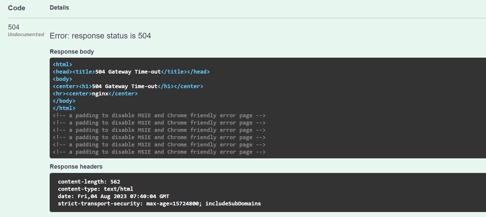
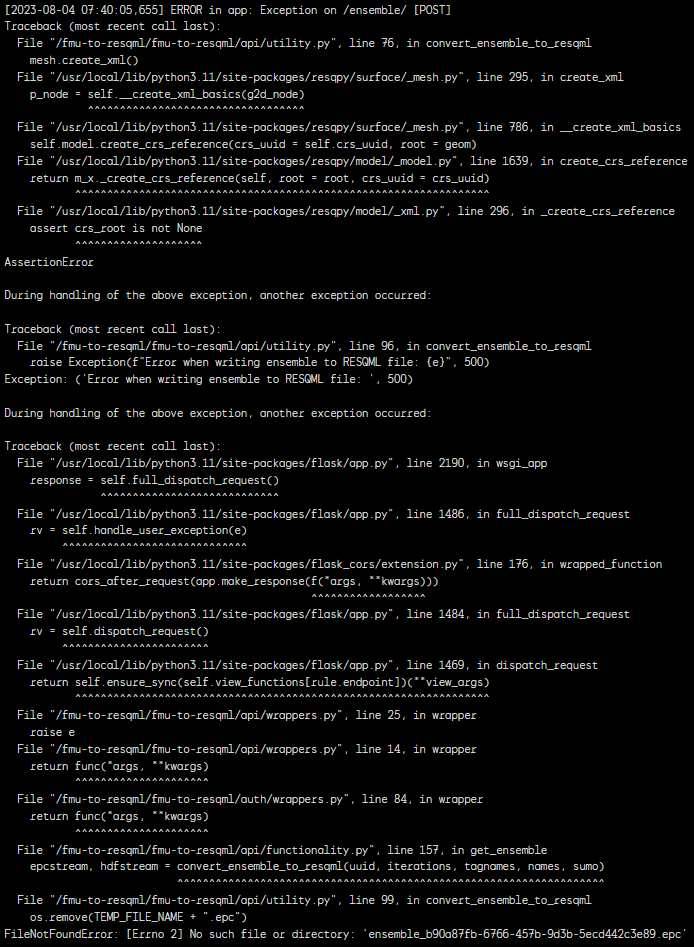

# fmu-to-resqml

This is a service interacting with [fmu-sumo](https://github.com/equinor/fmu-sumo) and [resqpy](https://github.com/bp/resqpy) to convert data from FMU (Fast Model Update™) to RESQML format.

------------------------------------------------------------------

## API

### Requests:

* **POST** - Converting and retrieving an ensemble of realizations within a case

* **GET** - Converting and retrieving one object 
* **POST** - Converting and retrieving several objects


### Endpoints:

* `url/ensemble/` - Ensemble converting and retrieving a single EPC and HDF5 file zipped together.
* `url/ensemble/epc` - Ensemble converting and retrieving a single EPC file.
* `url/ensemble/hdf` - Ensemble converting and retrieving a single HDF5 file.

* `url/objects/` - Object converting and retrieving both EPC and HDF5 files zipped.
* `url/objects/epc` - Object converting and retrieving only EPC files. Will be zipped if using POST.
* `url/objects/hdf` - Object converting and retrieving only HDF5 files. Will be zipped if using POST.

### Parameters:

#### Ensembles:

Only uses **POST** - Add case uuid and filter specifications as parameters in request body using JSON object format: 

```json
{
    "uuid" : "<case_uuid>",
    "iter" : ["<iteration_1>", "<iteration_2>"],
    "tags" : ["<tag_name_1>", "<tag_name_2>", "<tag_name_3>"],
    "name" : ["<name_1>", "<name_2>", "<name_3>"]
} 
```
**Note:** *name field can be left blank, and will then return realizations regardless of name, following iteration and tagname filter*.

#### Objects:

Using **GET** - Add object uuid as parameter in request arguments using `url/.../?uuid=<object_uuid>`.

Using **POST** - Add object uuids as parameters in request body using json object format:
```json
{ 
    "uuids" : ["<object_1_uuid>", "<object_2_uuid>", "<object_3_uuid>"] 
}
``` 

------------------------------------------------------------------

## Known Issues **!!**

There currently exists and issue with the **ensemble** endpoint.

When requesting smaller ensembles the service works as expected, like; *(this one contains 5 objects)*
```json
{
  "uuid": "c616019d-d344-4094-b2ee-dd4d6d336217",
  "iter": [
    "iter-0"
  ],
  "tags": [
    "DS_extract_geogrid",
    "apstrend_aps_Crevasse_Average"
  ],
  "name": [
  ]
}
```

After some wait we get a zip file with a single EPC and HDF5 file back.

However, when requesting larger ensembles, we end up with a Gateway timeout like; *(this one contains 155 objects)*
```json
{
  "uuid": "b90a87fb-6766-457b-9d3b-5ecd442c3e89",
  "iter": [
    "iter-0"
  ],
  "tags": [
    "DS_extract_geogrid"
  ],
  "name": [
    "VOLANTIS GP. Top"
  ]
}
```

This is most likely due to cases becoming very large, and resqpy taking a long time converting and formatting the whole ensemble into a single epc file.

For reference, these are the error messages;



